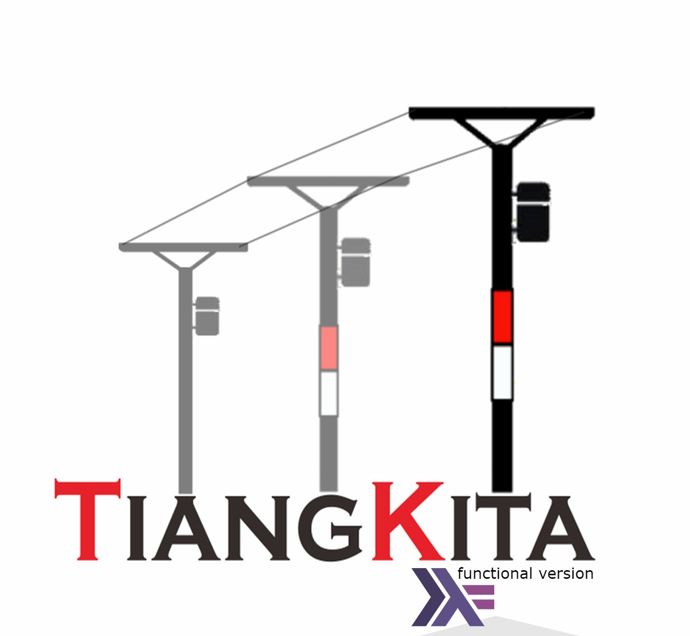

# TiangKita Console: Nearby Poles Validator (functional version of TiangKita Mobile App)

A nearby poles validator. Created using Haskell, this mini project is targeted to participate TelkomAthon Bacth 3 Stream Blockchain.

## Feature
1. Authorization. It's required you can use 
    this will set user log online
2. Get Telkom Area & Google Public Area (with exception handler)
3. Validate nearby poles based on coordinates (Eksisting Tiang)
4. Add (found new Tiang)
5. Log Out
    this will set logged on user log back to offline

## How to use
1. Install GHC, cabal-install and haskell-language-server via [GHCup](https://www.haskell.org/ghcup/)
2. Open terminal, and change directory to this project
3. Run `$ cabal build`
4. After it successfully built, run this project with `$ cabal run`
5. You can use (username: bas, password: mypassword) for login. Or insert your self with Bcrypted password in to users.log file

## Technical things:
1. format input failsafe
2. exception handling
3. HTTP Request
4. Password encrypt
5. Read Write and Update logs
